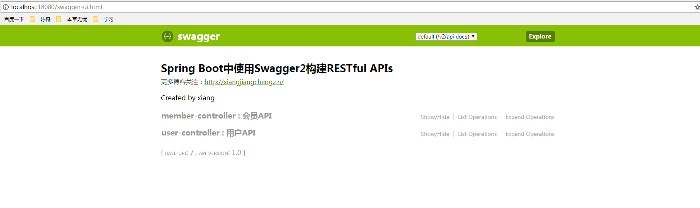

### spring-boot-core

### init project
新建项目所选依赖：jpa mysql jdbc web lombox    

### 后续引入
1. swagger2 # Api文档

2. devtools  # 热部署

3. redis  # 缓存数据库

4. jackson  # json

5. configuration-processor # 读取配置

6. Elasticsearch # 全文搜索

7. rabbitmq   # 消息队列

### 运行访问
swagger2: http://localhost:18080/swagger-ui.html

windows rabbitmq访问： http://localhost:15672/

### 参考代码 Github

[Spring Boot 中使用 Java API 调用 Elasticsearch](https://github.com/souyunku/spring-boot-examples/tree/master/spring-boot-elasticsearch-demo)

[spring boot + vue + element-ui全栈开发入门——开篇](http://www.cnblogs.com/GoodHelper/p/8430422.html)